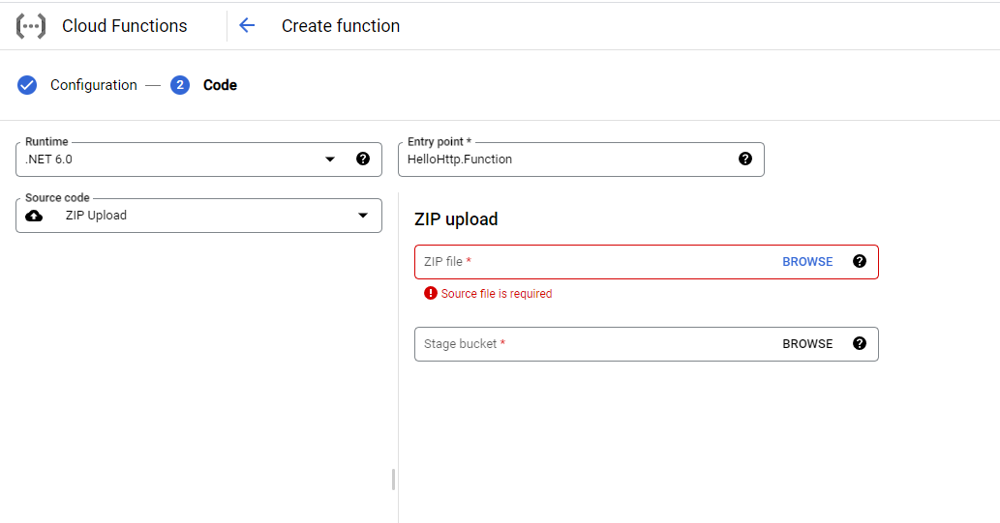

# Simple HelloWorld Function With GCloud Functions

## Abstract

I was curious about Google Cloud Technologies like **Cloud Functions**. So I developed simple **Hello Function via .NET Core 6**.

## Philosophy

Build Simple HelloWorld GCloud Function via GCloud.

## Contents

- [Simple HelloWorld Function With GCloud Functions](#simple-helloworld-function-with-gcloud-functions)
  - [Abstract](#abstract)
  - [Philosophy](#philosophy)
  - [Contents](#contents)
  - [Features](#features)
  - [Requirements](#requirements)
  - [Deployment](#deployment)
  - [Contributing](#contributing)
  - [Bug Reports \& Feature Requests](#bug-reports--feature-requests)
  - [RoadMap](#roadmap)

## Features

- Developed via **.Net Core 6**

## Requirements

> GCloud Account

## Deployment

Deployment is simple, drag and drop the zip file of project. The screenshot is below:

## Contributing

I am open every advice for my project. I am planning to improve myself on **.NET Core 6, Google Cloud Functions**. So don't hesitate comment on my project. Every idea is plus for me.

## Bug Reports & Feature Requests

Please use the Github issues.

## RoadMap

- In the Future, i am planning to improve myself on Google Cloud Functions.
